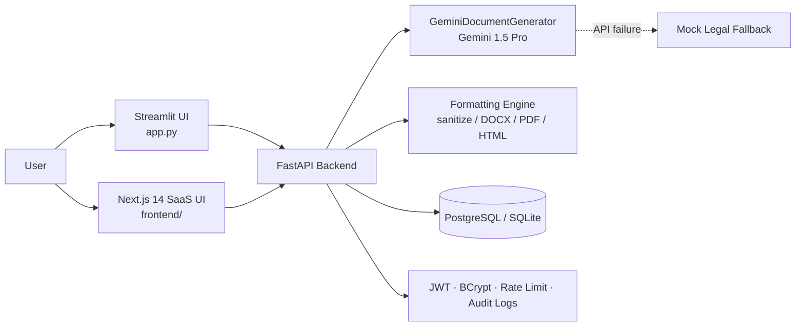

<div align="center">

# ⚖️ LegalEase

### AI-Powered Legal Document Generator & Intelligence Platform

**Draft Smarter. Understand Better.**


*Built for founders, corporate operators, legal professionals, and modern teams.*

</div>

---

## 📑 Table of Contents

1. [Overview](#-overview)
2. [Key Features](#-key-features)
3. [Tech Stack](#-tech-stack)
4. [System Architecture](#-system-architecture)
5. [Project Structure](#-project-structure)
6. [Quickstart](#-quickstart)
7. [Environment Variables](#-environment-variables)
8. [API Reference](#-api-reference)
9. [Benchmark Scenarios](#-benchmark-scenarios)
10. [Testing & Audit](#-testing--audit)
11. [Documentation](#-documentation)
12. [Team](#-team)

---

## 🌟 Overview

**LegalEase** is a production-grade legal document generation and intelligence platform. It combines two tiers in a single repository:

| Tier | What it is | Based on |
| :--- | :--- | :--- |
| **1. Specification Baseline** | FastAPI backend + Gemini AI core + Streamlit frontend | `LegalEase.pdf` (25-page spec, fully audited) |
| **2. Full-Stack SaaS Extension** | Next.js 14 platform with auth, templates, Document Studio, and contract analysis | Modern SaaS enhancement |

Describe what you need in plain language, and LegalEase drafts a structured, professionally formatted legal document you can edit, refine with AI, and export as **TXT, DOCX, or PDF**.

---

## ✨ Key Features

### 📄 Tier 1 — Specification Baseline (`LegalEase.pdf`)

- **FastAPI backend** with `GET /` (health/status) and `POST /generate` (document generation).
- **Gemini 1.5 Pro AI core** (`ai_core.gemini_generator.GeminiDocumentGenerator`) with structured legal prompt engineering and a **resilient mock fallback** when the API is unavailable.
- **Formatting engine** — `sanitize_text`, `format_docx`, `format_pdf`, `format_html_preview`:
  - Times New Roman typography
  - Front-page logo embedding
  - **Schedule A** terms table generation
  - Running page footers
- **Streamlit frontend** (`app.py`):
  - 3-column logo header
  - Dark HTML preview card
  - Inline editor — *"Click to Edit Document"*
  - Multi-format downloads (`.txt`, `.docx`, `.pdf`)
  - 1-click loaders for all three benchmark scenarios

### 🚀 Tier 2 — Modern SaaS Extension

- **17+ production legal templates** with dynamic JSON-Schema-driven forms.
- **3-Column Document Studio**
  - Live document outline
  - Typography-tuned editing canvas
  - Contextual AI Assistant with **side-by-side diff previews** and explicit **Accept / Reject** actions
- **Autosave, revision history, and one-click rollback.**
- **Contract Intelligence Analyzer** — upload PDF, DOCX, or TXT agreements for analysis.
- **Enterprise security** — JWT auth, BCrypt password hashing, rate limiting, structured JSON audit logging.
- **Responsive UI** for desktop and mobile (Tailwind CSS + Lucide icons).

---

## 🧰 Tech Stack

| Layer | Technologies |
| :--- | :--- |
| **Backend** | Python 3.12 (3.11+ supported), FastAPI, Uvicorn |
| **AI Core** | Google Gemini (`gemini-1.5-pro` via `google.generativeai`) + mock legal fallback |
| **Document Output** | `python-docx`, `fpdf2`, `reportlab`, `pypdf`, `Pillow` |
| **Data / ORM** | SQLAlchemy 2.x, Alembic, PostgreSQL / SQLite |
| **Security** | Passlib (BCrypt), PyJWT (HS256), in-memory rate limiter |
| **Logging** | Structured JSON request-logging middleware |
| **Frontend A** | Streamlit (`app.py`) — conforms to `LegalEase.pdf` Milestones 4 & 5 |
| **Frontend B** | Next.js 14 (App Router), TypeScript 5, Tailwind CSS, Lucide React |

---

## 🏗️ System Architecture



See [`ARCHITECTURE.md`](ARCHITECTURE.md) for data models and component flows.

---

## 📁 Project Structure

```text
legalease/
├── app.py                      # Streamlit frontend (PDF-spec UI)
├── requirements.txt
├── ai_core/
│   └── gemini_generator.py     # GeminiDocumentGenerator + fallback
├── backend/
│   ├── app/
│   │   └── main.py             # FastAPI entrypoint
│   └── tests/                  # 27 pytest tests
├── frontend/                   # Next.js 14 enterprise SaaS app
├── scripts/
│   └── audit_project.py        # Automated spec compliance audit
├── AUDIT_REPORT.md
├── ARCHITECTURE.md
├── API.md
├── SECURITY.md
├── CHANGELOG.md
└── LegalEase.pdf               # Source-of-truth specification
```

> Folder names may vary slightly — adjust to match your repository.

---

## ⚡ Quickstart

### Prerequisites

- Python **3.11+**
- Node.js **18+** and npm **9+** *(only for the Next.js frontend)*
- A **Google Gemini API key** *(optional — the app falls back to mock output without it)*

### 1️⃣ Clone & set up Python environment

```bash
git clone https://github.com/your-repo/legalease.git
cd legalease

python -m venv .venv
source .venv/bin/activate        # Windows: .\.venv\Scripts\activate

pip install -r requirements.txt
```

### 2️⃣ Configure environment

```bash
cp .env.example .env
# then edit .env and add your keys (see "Environment Variables" below)
```

### 3️⃣ Start the FastAPI backend

```bash
uvicorn backend.app.main:app --reload --port 8000
```

| Endpoint | URL |
| :--- | :--- |
| Status | http://127.0.0.1:8000/ |
| Generate | http://127.0.0.1:8000/generate |
| Swagger docs | http://127.0.0.1:8000/docs |

### 4️⃣ Choose a frontend

**Option A — Streamlit (LegalEase.pdf spec)**

```bash
streamlit run app.py
```

Opens at **http://localhost:8501** — 3-column logo header, dark preview card, inline editor, export buttons, and 1-click loaders for Scenarios 1, 2, and 3.

**Option B — Next.js 14 Enterprise SaaS**

```bash
cd frontend
npm install
npm run dev
```

Opens at **http://localhost:3000** — authentication, template gallery, 3-column Document Studio, and contract upload intelligence.

**Demo credentials (SaaS web app):**

| Field | Value |
| :--- | :--- |
| Email | `demo@legalease.io` |
| Password | `LegalEase2026!` |

> ⚠️ Demo credentials are for local development only. Remove or change them before any public deployment.

---

## 🔐 Environment Variables

| Variable | Description | Required |
| :--- | :--- | :---: |
| `GEMINI_API_KEY` | Google Gemini API key. Without it, the mock fallback is used. | Optional |
| `JWT_SECRET` | Secret used to sign HS256 JWTs. | Yes (SaaS) |
| `DATABASE_URL` | SQLAlchemy URL, e.g. `sqlite:///./legalease.db` or a PostgreSQL URL. | Yes (SaaS) |
| `NEXT_PUBLIC_API_URL` | Backend URL for the Next.js app, e.g. `http://127.0.0.1:8000`. | Yes (Next.js) |

> 🔒 Never commit `.env` files or API keys to version control.

---

## 🔌 API Reference

| Method | Endpoint | Description |
| :---: | :--- | :--- |
| `GET` | `/` | Health / status check |
| `POST` | `/generate` | Generate a legal document from structured inputs |

Full request/response schemas and examples: [`API.md`](API.md) or the live Swagger UI at `/docs`.

---

## 🎯 Benchmark Scenarios

These three scenarios from `LegalEase.pdf` are available as 1-click loaders in the Streamlit app.

| # | Document Type | Key Inputs | Verified Output |
| :---: | :--- | :--- | :--- |
| **1** | **Employment Contract** | Startup founder, new hire, role, responsibilities, compensation, confidentiality | Branded **PDF** with embedded logo and footer |
| **2** | **Non-Disclosure Agreement** | Freelancer, client, confidentiality scope, 3-year term, effective date | Structured agreement with non-disclosure covenants |
| **3** | **Residential Lease Agreement** | Landlord, tenant, property address, rent, deposit, terms | Formatted **DOCX** with Schedule A terms table |

---

## 🧪 Testing & Audit

```bash
# Spec-specific tests
pytest backend/tests/test_pdf_specification.py -v

# Full backend suite (27 tests)
pytest backend/tests -v

# Automated audit against all 25 pages of LegalEase.pdf
python scripts/audit_project.py

# Production build of the Next.js frontend
cd frontend && npm run build
```
Backend=https://github.com/megalaelumalai022-cloud/LegalEase/
Frontend=https://legal-ease-henna.vercel.app/
---

## 📚 Documentation

| Document | Purpose |
| :--- | :--- |
| [`AUDIT_REPORT.md`](AUDIT_REPORT.md) | Specification audit and requirement comparison matrix |
| [`ARCHITECTURE.md`](ARCHITECTURE.md) | System architecture, data models, component flow |
| [`API.md`](API.md) | REST endpoints, schemas, request/response examples |
| [`SECURITY.md`](SECURITY.md) | Sanitization, auth, rate limiting, data privacy |
| [`CHANGELOG.md`](CHANGELOG.md) | Version history |
| [`LegalEase.pdf`](LegalEase.pdf) | Foundational 25-page specification |

---

## 👥 Team

| Name | Role | Email |
| :--- | :--- | :--- |
| **Megala E** | 👑 Team Lead | megalaelumalai022@gmail.com |
| **Nithisha** | Team Member | nithisha200611@gmail.com |
| **Pooja sri** | Team Member | psri45721@gmail.com |
| **Preethi** | Team Member | Preethialex61@gmail.com |

---

## ⚠️ Disclaimer

LegalEase generates AI-assisted drafts for informational purposes only. It does not provide legal advice. Have a qualified legal professional review any document before it is signed or relied upon.

---

<div align="center">

**Draft Smarter. Understand Better.** ⚖️

Made with ❤️ by the LegalEase Team

</div>
